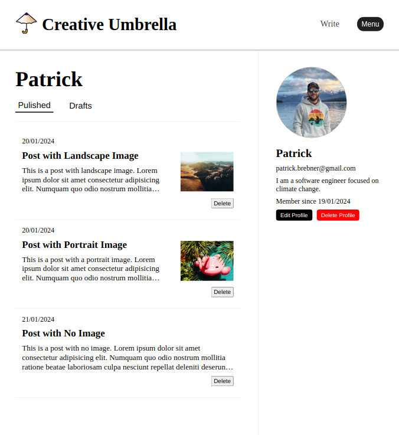

# Blog Client

## About

This project was made as part of The ODIN Project's NodeJS curriculum. This repository comprises the frontend portion of this app. The goal of this project was to create a restful API backend which could be used to fetch data for this blog client.

Users are able to sign-up, manage their profiles, view and post content, and interact with others content through comments and likes.

[Link to API](https://github.com/pbrebner/blog-api)

[Check it Out Live](https://pbrebner.github.io/blog-client/)

## Features

-   Persistent Authentication using JWTs
-   Intuitive User Interface
-   Integration with Backend/API and MongoDB Database
-   Save images to AWS S3 Bucket and retrieve with URI stored in MongoDB database
-   Ability to Create, edit and delete blog posts
-   Interact with others content through comments or likes
-   Update users profile

## Technologies Used

-   React
-   React Router
-   HTML/CSS
-   JWTs
-   AWS S3
